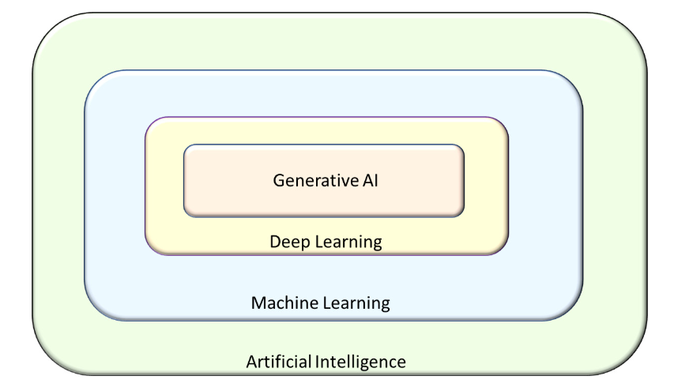

# Gen AI Context on Kubernetes 

Generative AI (GenAI) is revolutionizing the way organizations build intelligent systems by enabling machines to create content, code, text, images, and more. 
As demand for large-scale AI applications continues to grow, Kubernetes (K8s) has become the de facto platform to manage these workloads with scalability, resilience, and efficiency.

1. How to run LLMs and deploy state-of-the-art models on Kubernetes
2. Production-Grade Blueprint

