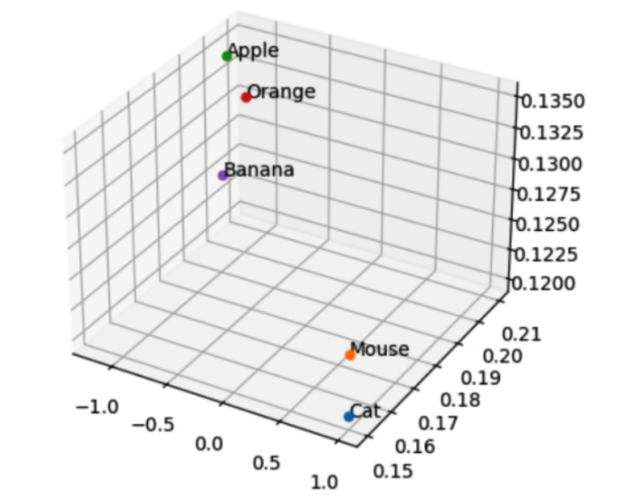
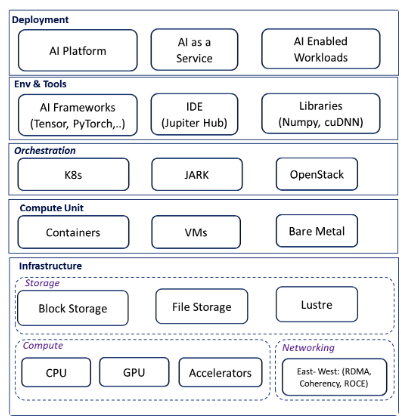

# Transformer Architecture 

A transformer model uses an encoder-decoder architecture, where the encoder maps the input sequences/tokens through a self-attention mechanism. 

This mapped data is used by the decoder to generate the output sequence.

The mapping of input tokens retains not only their intrinsic values but also their context and weight in the original sequence.

### Input Embeddings

this is a key part of the transformer model, which converts input sequences/tokens into high-dimensional vector embeddings.
In real-world applications, output embeddings from a trained model may be stored in high-dimensional vector databases, such as Elasticsearch, Milvus, or PineCone. 

Vector databases help to find similar searches in high-dimensional space using either Euclidian distance or cosine similarity, and similar objects are assigned closer to each other in this high-dimensional vector space. 

Performance-Efficient Fine Tuning (PEFT), which only updates a small set of weights and thus reduces the compute requirements.

### LoRA 
Low Rank Adoption (LoRA) is a very popular form of PEFT, where the original model matrix is reparametrized using a low-rank representation to significantly reduce the number of model parameters to be updated. 

### QLoRA
 Another version of LoRA is QLoRA (Quantized Lower Rank Adoption). In QLoRA, we use quantization to compress the model weights from 32-bit precision to 8-bit or 4-bit precision, which dramatically reduces the model size and makes it easier to run on GPUs with less memory.

### Deployment Stack 

## Infrastructure Layer

#### Compute Layer
1. For compute, we can use options such as CPUs, GPUs, custom accelerators, or a combination of these.
2. LLMs are very computationally intensive. 
3. GPUs offer massively parallel matrix multiplication capabilities and are mostly favored for training workloads. 
4. For inference, both CPUs and GPUs are used, but for LLMs with billions of model parameters, GPUs are often needed for inference as well.
5. Besides CPUs and GPUs, there are custom accelerators, such as AWS Inferentia and Trainium, which are custom silicon chips specially designed for ML and highly optimized for mathematical operations.

#### Networking Layer
Networking is the next critical infrastructure component. 
For language models that are very large, both training and inference could become a distributed system problem. 

#### Note: 
It’s evident here that GenAI models are growing exponentially, and more parameters generally mean a more complex model that can capture more intricate patterns in data, thus requiring more computational resources for training and inference.
if we say a model has 1 billion parameters, it usually refers to model weights after training has been completed. 

East-West traffic, that is, the traffic flowing within the data center nodes or GPUs, could become a performance bottleneck for large model training or fine tuning. For this reason, non-blocking networking technologies such as memory coherence and Remote Direct Memory Access (RDMA) could help scale performance across nodes.

#### Remote Direct Memory Access (RDMA)
RDMA is a technology that lets nodes in a distributed system access the memory of other nodes without involving either the core processor or operating system.

