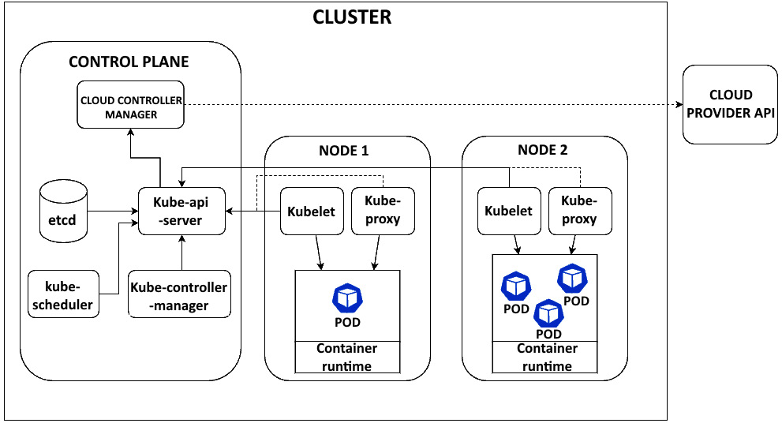

# Introduction

Kubernetes helps ensure the high availability of big data applications through features such as self-healing and auto-restarting of failed containers.

Containers are a key technology for modern software deployment. They are lightweight, portable, and scalable, allowing you to build and ship applications faster.

