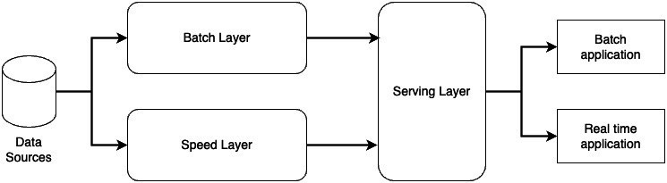

# Lambda architecture 
is a design pattern for building data processing systems that can handle large-scale and real-time data efficiently. It integrates both batch and real-time processing to achieve scalability, fault tolerance, and low-latency responses. The architecture is commonly used in big data and analytics platforms.

# Components of Lambda Architecture:

## Batch Layer:
Purpose: Handles large-scale data processing by processing data in batches.
Functionality: Stores the immutable, raw data in its entirety (e.g., using distributed storage like HDFS or S3).
Computes pre-aggregated views or batch jobs for historical data analysis.

Tools: Hadoop, Spark, or similar batch-processing frameworks.

## Speed Layer:
Purpose: Processes real-time data to provide low-latency outputs.
Functionality: Ingests and processes data streams as they arrive.
Complements the batch layer by providing up-to-the-moment results.

Tools: Apache Kafka, Apache Flink, Apache Storm, or similar stream-processing systems.

## Serving Layer:
Purpose: Combines and serves data processed by both the batch and speed layers.
Functionality: Exposes data to applications, often as APIs or queryable databases.
Merges real-time insights from the speed layer with the precomputed results from the batch layer.

Tools: Cassandra, HBase, or any queryable data store.

