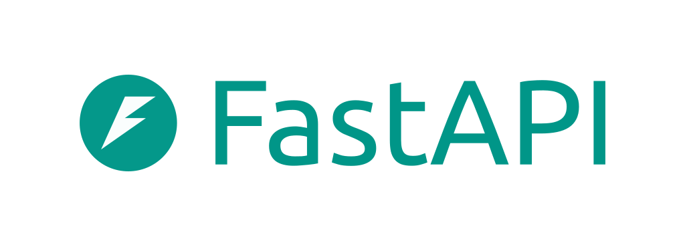

#  FastAPI Web Framework 

FastAPI is a modern, fast (high-performance), web framework for building APIs with Python based on standard Python type hints.

1. Built on Starlette & Pydantic; faster than Flask/Django for many use cases.
2. Uses Pydantic to validate incoming request data automatically.
3. Automatically generates Swagger UI and ReDoc docs.
