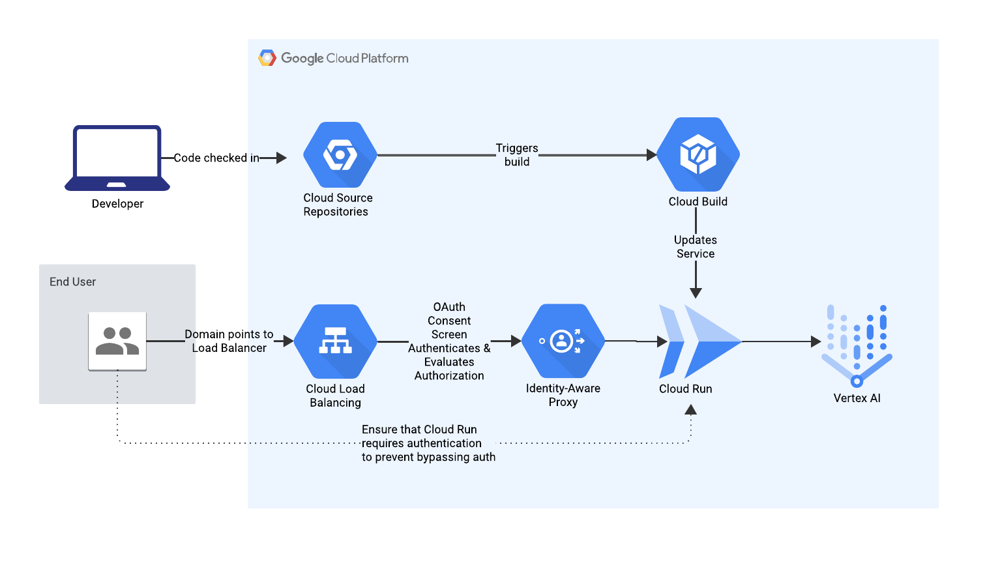

App is written in Python using the popular web microframework Flask. It uses a package called Bootstrap Flask to easily implement the Bootstrap front-end framework in a Flask app. 
Bootstrap makes some default design decisions for us so you can present a nice UI without needing to design it from scratch yourself.

