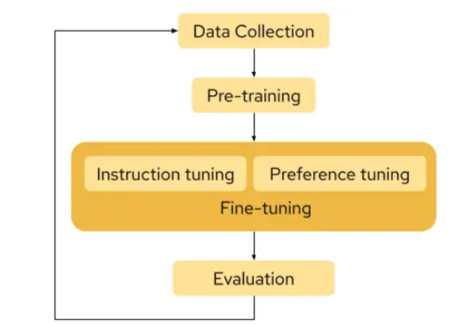

# Redhat Linux AI

Red Hat Enterprise Linux (RHEL) AI addresses this challenge by providing a low-cost, security-focused, single-server environment to experiment with large language models. RHEL makes it easy for users with little to no data science expertise to start developing and enhancing large language models without any data privacy or security concerns. 

# How are LLMs created?

### LLM workflow stages 

