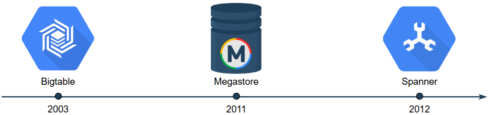

# Bigtable

Bigtable is a distributed database — specifically a wide-column NoSQL distributed database developed by Google.

The keys have some elaborate structure to them that helps construct a table-like abstraction on top of it.

The data can be multi-versioned, which helps speed up concurrent reads and writes without locking for some use cases.

A few table columns are physically kept together to benefit from the locality.

Bigtable is a column-family database that introduced many innovations like SSTables. This system shows us how a key-value store can be a high-performance database. Bigtable does not provide strong data consistency across table rows (the guarantees are only at the key level). Additionally, the data model of Bigtable is not relational, which implies that users of Bigtable have a learning curve.

# Megastore 

While Bigtable was suitable for many use cases, developers of online transactional processing (OLTP) applications were challenged to build applications without a strong schema, cross row, cross-shard transactions, and the familiar SQL query language. Megastore was the response to that need. Megastore was built on top of Bigtable and provided stronger consistency within a shard of a table. However, the application code needed a lot of work in its code to do more complicated transactions. Additionally, the performance of such applications was often low.

# Spanner 
Spanner provided the ability of transactions across shards with external consistency, and many lock-free operations like read snapshots. Surprisingly, the innovations of Spanner were due to a special kind of timing mechanism (called TrueTime), where Google could control the clock's skew and construct linearizability guarantees on top of that. Additionally, Google's private wide-area network between data centers with redundant paths made the network partitions less often, and therefore resulted in high availability. Additionally, Spanner provided an SQL language to interface with the system.

